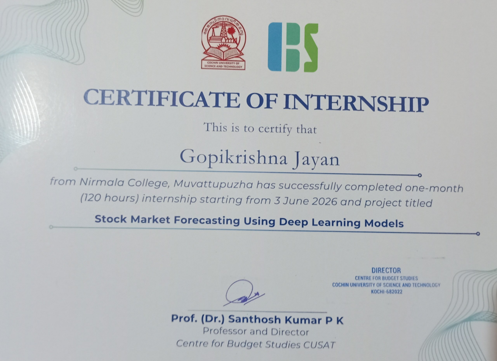

# 👋 Hi, I'm Gopikrishna Jayan

### M.Sc. Statistics | Data Analytics | Machine Learning | Statistical Modeling

📊 Data Analytics | 📈 Statistical Modeling | 🤖 Machine Learning | 📉 Predictive Analytics

---

<h2>👨‍💻 About Me</h2>

I am an **M.Sc. Statistics graduate** with a strong interest in **Data Analytics, Statistical Modeling, Machine Learning, Predictive Analytics, and Business Intelligence**.

I work with **Python, R, SQL, SAS, Power BI, and Excel** to clean, analyze, visualize, and model data. I enjoy transforming complex datasets into meaningful insights and supporting data-driven decision-making.

My experience includes **financial analytics, clinical data analysis, predictive modeling, time-series forecasting, dashboard development, and statistical analysis**.

---

<h2>🛠️ Knowledge & Skills</h2>

 

 

 

 

---

<h2>💼 Internship Experience</h2>

<h3>🧬 IQVIA — Three Months Training Program</h3>

<b>January 2026 – March 2026</b>

- Drug Discovery & Development
- SAS Programming
- CDISC SDTM
- CDISC ADaM
- TLF Report Generation

---

<h3>📊 UPSTA Analytics — Internship Program</h3>

<b>November 2025 – December 2025</b>

- Financial & Accounts Receivable Analytics
- Data Cleaning & Transformation
- Exploratory Data Analysis
- Predictive Modeling
- Business Intelligence Reporting
- Dashboard Development
- Financial Insights Generation

### 📜 Internship Certificate

<a href="./assets/certificates/upsta-certificate.pdf">
<b>📄 View UPSTA Internship Certificate</b>
</a>

---

<h3>📈 Centre for Budget Studies (CBS), CUSAT — Research Internship</h3>

<b>June 2026 – July 2026</b>

- Stock Price Forecasting using Python
- Time Series Analysis
- Deep Learning using LSTM and DeepAR
- Financial Data Analysis
- Predictive Analytics
- Model Evaluation using RMSE, MAE, MAPE and R²

### 📜 Internship Certificate

---

<h2>🚀 Projects</h2>

| Project | Description |
|------------|----------------|
| [🌧️ Rainfall-Driven Flood Risk Assessment Framework for Kochi](#) | Analyzed rainfall and climate data for Kochi using statistical and machine learning methods. Applied seasonality analysis and Extreme Value Theory (EVT) to study extreme rainfall patterns and flood vulnerability. |
| [📈 Stock Price Forecasting of Cipla Ltd. Using LSTM and DeepAR](#) | Forecasted Cipla stock prices using historical market data. Applied LSTM and DeepAR for deep learning and probabilistic forecasting and evaluated models using RMSE, MAE, MAPE and R². |
| [💬 NLP-Based Sentiment Analysis on Amazon Product Reviews](#) | Developed an NLP-based sentiment analysis model using TF-IDF and machine learning algorithms including Naive Bayes, Logistic Regression and SVM. |

---

<h2>🎓 Education</h2>

### M.Sc. Statistics

**Nirmala College Autonomous, Muvattupuzha**  
2024 – 2026

### B.Sc. Mathematics

**Nirmala College Autonomous, Muvattupuzha**  
2021 – 2024

---

<h2>🏆 Certifications</h2>

- 🐍 Associate Data Scientist in Python — DataCamp
- 🗄️ Associate Data Analyst in SQL — DataCamp
- 📊 Data Analyst in R — DataCamp
- 📈 Data Analysis and Visualization with Power BI — Coursera
- 🤖 IBM Machine Learning with Python — Coursera
- 🧬 SAS Programmer — Coursera
- 📊 Introduction to Tableau — Coursera
- ⚡ Big Data with PySpark — DataCamp
- 📑 Google Sheets Fundamentals — DataCamp

---

<h2>🎯 Areas of Interest</h2>

- Data Analytics
- Statistical Modeling
- Machine Learning
- Predictive Analytics
- Time Series Forecasting
- Business Intelligence
- Data Visualization
- Clinical Data Analysis
- Financial Analytics

---

<h2>👨‍🏫 Activities</h2>

<h3>📊 Resource Person — Google Sheets Training</h3>

Conducted a hands-on training session for B.Sc. Mathematics students covering **data analysis, data cleaning, and visualization using Google Sheets**.

<h3>📐 Project Support — Linear Algebra Research Project</h3>

Supported junior students in a research project involving **covariance analysis, eigenvalue decomposition, and Singular Value Decomposition (SVD)** for studying high-dimensional data.

---

<h2>📫 Contact</h2>

📧 <b>Email:</b> <a href="mailto:krishnajayangopi@gmail.com">krishnajayangopi@gmail.com</a>

💼 <b>LinkedIn:</b> <a href="https://www.linkedin.com/in/gopi-krishna-5262052b0">Gopikrishna Jayan</a>

💻 <b>GitHub:</b> <a href="https://github.com/GOPIKRISHNAJAYAN">GOPIKRISHNAJAYAN</a>

📍 <b>Kerala, India</b>

---

### ⭐ Thanks for visiting my profile!

**Turning Data into Insights | Learning | Building | Growing**

